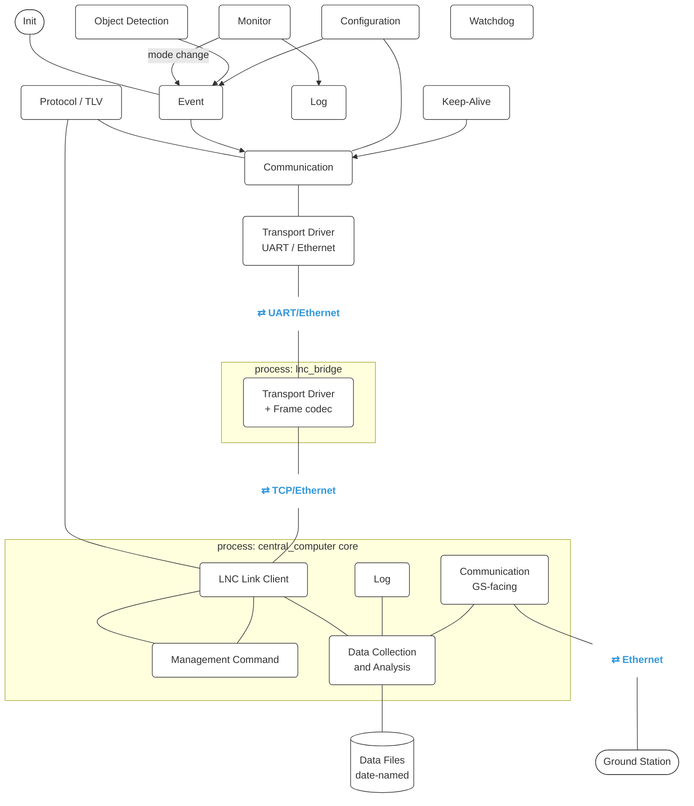

# Submarine Monitoring System — Full Technical Description

Source spec: `final project.pdf` (SW-FD-LNC-001, Software Functional Definition)

> **Status of this document:** Sections 3 (Protocol) and 4 (Module Descriptions) contain a concrete proposed design filling in details the spec leaves open (exact tag byte values, field sizes, frame envelope). These are a starting point, not handed-down fact — we refine them together as we hit each phase, per the gating rule in §6.

---

## 1. Project Overview

A real-time submarine telemetry and monitoring system, split into three communicating programs plus one standalone OOP exercise:

| Component | Platform | Role |
|---|---|---|
| **LNC End Unit** | C, STM32 + FreeRTOS | Installed in the submarine. Hosts temperature, humidity, light, battery (potentiometer) sensors, and a sonar object-detection input. |
| **Central Computer** | C++ (PC) | Manages all end units (LNC, motor unit, navigation unit). Talks to this LNC over UART (via a dedicated `lnc_bridge` process, §4.11), and to the Ground Station over Ethernet. |
| **Ground Station** | C++ (PC) | Requests historical log/event data from the Central Computer for a given time range, across possibly several submarine types. |
| **Submarine Fleet Management (OOP part)** | C++ (PC) | Manages a fleet of `ResearchSubmarine` / `CombatSubmarine` objects; each `CombatSubmarine` owns a `CentralComputer` instance. |

All inter-node application messages use **TLV (Tag, Length, Value)** encoding (§3). Two distinct physical links exist, each with its own driver (§4.10):

- **LNC ↔ Central Computer** — UART, and *only* UART for this LNC: the MCU has no Ethernet hardware (no PHY/MAC), so this is a physical constraint, not a configuration choice. The Communication module still sits behind a transport-independent interface (spec §1.2 NOTE) — not because *this* link will ever switch, but because that's a structural requirement of the spec, and because the Central Computer manages other end units (a motor unit, a navigation unit, spec §1.2) that could use a different transport, Ethernet included. `Transport_Send/Recv` (§4.10) is what makes that possible without touching Communication logic — it just happens to only ever be backed by UART on this particular board.
- **Central Computer ↔ Ground Station** — Ethernet, fixed, and a *separate* endpoint from the LNC-facing one.

These two links are physically independent, even though both live on the Central Computer machine: the CC holds a **serial port** open to the LNC at the same time as an **Ethernet socket** open to the GS, on the same PC's NIC. A PC can have both a COM port (or USB-UART adapter) and a network card simultaneously — they don't compete. The flow of control is `CC core → lnc_bridge → LNC` (§4.11–4.13): `lnc_bridge` is the process that actually owns the UART port and talks to this LNC; if the Central Computer ever needed to reach an Ethernet-capable end unit instead, that would be a *different* bridge process/socket on the CC side — this LNC itself never gains Ethernet.

**Central Computer is two OS processes, not one.** The LNC-facing link is owned entirely by a standalone `lnc_bridge` process (§4.11) — it does the framing/deframing and nothing else, doesn't know what a Management Command or a database is. The rest of Central Computer ("core": Management Command, Log, Data Collection & Analysis, GS-facing Communication) runs as its own process and talks to `lnc_bridge` over a **TCP socket, over Ethernet** (§4.12) — not local-only IPC. This is deliberate: `lnc_bridge` is the only piece of the system that ever touches UART, so it's the piece that would physically sit right next to the LNC's serial port, potentially on separate hardware from Central Computer core (e.g. a small gateway board wired directly to the LNC). Core reaches it exactly the same way whether it's on the same machine (`127.0.0.1`, the normal case for this project) or across the LAN. This also resolves how the spec's "UART or Ethernet" line applies here: **from Central Computer core's own code, the LNC link is always Ethernet/TCP** — UART only exists on the one hop between `lnc_bridge` and the physical LNC.

---

## 2. Architecture



---

## 3. Protocol — TLV over a Framed Link

### 3.1 TLV Unit

```
┌────────────────┬───────────────┬───────────────────────┐
│  Tag (1 byte)  │ Length (2 B)  │  Value (Length bytes)  │
└────────────────┴───────────────┴───────────────────────┘
```

TLVs can nest — a top-level message tag's Value is itself a sequence of field TLVs (e.g. `KEEP_ALIVE`'s value contains a `TIMESTAMP` TLV, a `MEASUREMENT_RECORD` TLV, and a `MODE` TLV back to back). Nesting is capped at 2 levels: a message tag's Value is a sequence of field TLVs, and the only field allowed to nest further is `MEASUREMENT_RECORD` — every other field is a leaf. This keeps decoding non-recursive and bounded, which matters for FreeRTOS task stack usage on the LNC.

Module code never hand-loops over a value's bytes to pull out the field it wants — the shared codec (`common/protocol.h`) provides `Protocol_FindField(buf, len, tag, ...)`, a single-level scan that returns the one field a caller asks for by tag, independent of what order fields actually arrived in. To reach a field inside `MEASUREMENT_RECORD`, a caller calls `Protocol_FindField` once for `MEASUREMENT_RECORD` itself, then again on that returned sub-buffer — nesting is handled by the caller making two calls, not by the codec recursing internally.

### 3.2 Frame Envelope (physical-link framing)

UART/Ethernet deliver a raw byte stream with no message boundaries, so every TLV message is wrapped in a frame before it hits the transport driver:

```
┌───────────┬──────────────┬───────────────────┬────────────┐
│ START 0x7E│ LENGTH (2 B) │  TLV payload (…)   │ CRC16 (2 B)│
└───────────┴──────────────┴───────────────────┴────────────┘
```

- `LENGTH` covers the TLV payload only (not START/LENGTH/CRC).
- `CRC16` is **CRC-16/CCITT-FALSE**: polynomial `0x1021`, initial value `0xFFFF`, no input/output reflection, no final XOR. Computed over `LENGTH` + the TLV payload (i.e. everything between `START` and `CRC16`). Chosen because it needs no bit-reflection logic to implement, keeping both sides' code simple.
- Byte-stuffing: if `0x7E` (start) or `0x7D` (escape) occurs anywhere in LENGTH, payload, or CRC, it is replaced with `0x7D` followed by `(byte XOR 0x20)`.
- Identical implementation required on the STM32 side and the PC side (Phase 2 in §6).

### 3.3 Top-Level Message Tags (LNC ↔ Central Computer)

| Tag (hex) | Name | Direction | Value Contents |
|---|---|---|---|
| 0x01 | SET_TEMP_NORMAL_RANGE | CC → LNC | TEMP_LOW + TEMP_HIGH |
| 0x02 | SET_TEMP_WARNING_RANGE | CC → LNC | TEMP_LOW + TEMP_HIGH |
| 0x03 | SET_HUMIDITY_NORMAL_MIN | CC → LNC | HUMIDITY_MIN |
| 0x04 | SET_HUMIDITY_WARNING_MIN | CC → LNC | HUMIDITY_MIN |
| 0x05 | SET_LIGHT_NORMAL_MIN | CC → LNC | LIGHT_MIN |
| 0x06 | SET_LIGHT_WARNING_MIN | CC → LNC | LIGHT_MIN |
| 0x07 | SET_BATTERY_NORMAL_MIN | CC → LNC | BATTERY_MIN |
| 0x08 | SET_BATTERY_WARNING_MIN | CC → LNC | BATTERY_MIN |
| 0x09 | SET_RTC_REQ | CC → LNC | TIMESTAMP |
| 0x0A | GET_TIME_REQ | CC → LNC | (empty) |
| 0x0B | GET_TIME_RESP | LNC → CC | TIMESTAMP |
| 0x0C | CONFIG_ACK | LNC → CC | STATUS |
| 0x0D | GET_MEASUREMENTS_REQ | CC → LNC | TIME_RANGE_START + TIME_RANGE_END |
| 0x0E | GET_MEASUREMENTS_RESP | LNC → CC | STATUS + MEASUREMENT_RECORD × N |
| 0x0F | GET_EVENTS_REQ | CC → LNC | TIME_RANGE_START + TIME_RANGE_END |
| 0x10 | GET_EVENTS_RESP | LNC → CC | STATUS + EVENT_RECORD × N |
| 0x11 | KEEP_ALIVE | LNC → CC | TIMESTAMP + MEASUREMENT_RECORD + MODE |
| 0x12 | EVENT_REPORT | LNC → CC | TIMESTAMP + EVENT_TYPE + EVENT_SOURCE + MEASUREMENT_RECORD (optional) |

### 3.4 Ground Station ↔ Central Computer Tags

Separate exchange over the second (Ethernet-only) link — the Ground Station must identify *which* submarine it means, since a Central Computer/fleet may cover several submarine types.

| Tag (hex) | Name | Direction | Value Contents |
|---|---|---|---|
| 0x13 | GS_GET_LOG_REQ | GS → CC | SUBMARINE_ID + TIME_RANGE_START + TIME_RANGE_END |
| 0x14 | GS_GET_LOG_RESP | CC → GS | STATUS + MEASUREMENT_RECORD × N |
| 0x15 | GS_GET_EVENTS_REQ | GS → CC | SUBMARINE_ID + TIME_RANGE_START + TIME_RANGE_END |
| 0x16 | GS_GET_EVENTS_RESP | CC → GS | STATUS + EVENT_RECORD × N |

### 3.5 Field Tags (nested inside message values)

| Tag (hex) | Name | Value |
|---|---|---|
| 0x20 | TIMESTAMP | 4 bytes, Unix epoch seconds |
| 0x21 | TEMP_LOW | 2 bytes, signed, tenths of °C |
| 0x22 | TEMP_HIGH | 2 bytes, signed, tenths of °C |
| 0x23 | HUMIDITY_MIN | 1 byte, % |
| 0x24 | LIGHT_MIN | 2 bytes |
| 0x25 | BATTERY_MIN | 2 bytes, mV |
| 0x26 | STATUS | 1 byte (see §3.6) |
| 0x27 | TIME_RANGE_START | 4 bytes, Unix epoch seconds |
| 0x28 | TIME_RANGE_END | 4 bytes, Unix epoch seconds |
| 0x29 | MEASUREMENT_RECORD | nested: TIMESTAMP + TEMPERATURE + HUMIDITY + LIGHT + BATTERY_VOLTAGE + MODE |
| 0x2A | EVENT_TYPE | 1 byte enum: MODE_CHANGE=0, OBJECT_DETECTED=1, OBJECT_CLEARED=2, CONFIG_CHANGED=3, STARTUP=4 |
| 0x2B | EVENT_SOURCE | 1 byte enum: MONITOR=0, OBJECT_DETECTION=1, CONFIGURATION=2, INIT=3 |
| 0x2C | MODE | 1 byte enum: NORMAL=0, WARNING=1, ERROR=2 |
| 0x2D | WD_RESET_FLAG | 1 byte bool (STARTUP events only) |
| 0x2E | TEMPERATURE | 2 bytes, signed, tenths of °C |
| 0x2F | HUMIDITY | 1 byte, % |
| 0x30 | LIGHT | 2 bytes |
| 0x31 | BATTERY_VOLTAGE | 2 bytes, mV |
| 0x32 | SUBMARINE_ID | UTF-8 string (serial number) |

### 3.6 Status Codes

| Code | Meaning |
|---|---|
| 0x00 | SUCCESS |
| 0x01 | INVALID_RANGE (e.g. low > high) |
| 0x02 | INVALID_TIME_RANGE |
| 0x03 | NO_DATA_FOUND |
| 0x04 | RTC_NOT_SYNCED |
| 0x05 | INTERNAL_ERROR |

### 3.7 Byte-Stream Parsing Strategy

Both the STM32 and PC Communication modules must:

1. Feed incoming bytes into a per-link receive buffer.
2. Scan for a `0x7E` start byte, undo byte-stuffing, and check whether `LENGTH` bytes of payload plus CRC are fully present.
3. If complete → verify CRC, decode the TLV payload, dispatch upward, remove consumed bytes from the buffer.
4. If incomplete → wait for the next read cycle for more data.

---

## 4. Module Descriptions

**LNC Task & Queue Architecture (overview).** Only 6 of the 9 LNC modules get their own FreeRTOS task — Log and Configuration are mutex-protected shared functions, not tasks, since nothing about them needs an independent thread of control (they're synchronous "write this, wait for it" operations called by whoever needs them). Init is a one-shot task: it creates every other task, blocks for the time-sync round-trip with Central Computer (which requires Communication's tasks to already be running), posts the `STARTUP` event, then self-deletes.

| Priority | Task | Trigger | Why this tier |
|---|---|---|---|
| Highest | `vWatchdogTask` | Periodic, faster than IWDG timeout | Must never starve — missing it resets the board |
| High | `vInitTask` | Once at boot; creates all tasks, then self-deletes | Startup should finish deterministically before routine work contends for CPU |
| High | `vObjectDetectionTask` | Periodic poll, 200ms, of an activity flag set by the IR receiver's EXTI ISR | Safety-relevant — kept at High priority despite polling rather than blocking, since the real hardware (a remote-control-style IR receiver) produces transient bursts, not a level a task can block on |
| High | `vCommRxTask` | UART RX ring buffer has data | Drain incoming commands/requests promptly |
| Medium | `vEventTask` | Blocks on `xEventQueue` | Drives LED/alarm — quick, but not as time-critical as the tier above |
| Medium | `vCommTxTask` | Any of 3 TX queues has data | Priority *among outbound message types* is handled by which queue it drains first, not by task priority |
| Medium | `vMonitorTask` | Periodic, 5s | Routine sampling — a little jitter is fine |
| Low | `vKeepAliveTask` | Periodic, 6s | Least urgent — just telemetry |

**Queues:**
- `xEventQueue` — Monitor (on mode change), Object Detection, Configuration, and Init all post to this; `vEventTask` blocks reading it. The message struct reuses `ProtoEventSource_t`/`ProtoEventType_t`/`ProtoMode_t` from `common/protocol.h` directly rather than inventing parallel internal enums, so the internal event representation and the wire `EVENT_REPORT` format stay aligned by construction.
- `xKeepAliveTxQueue` / `xEventTxQueue` / `xDataReportTxQueue` — the three priority tiers from §4.6. Three queues feed *one* `vCommTxTask`, which drains them in strict priority order (keep-alive, then event, then data) each iteration — the ordering is application logic inside that task, not FreeRTOS task-priority-based.

**Mutexes:**
- `xConfigMutex` — guards `Config_LoadFromFlash`/`Config_ApplyUpdate` (touched by Init, Monitor, and CommRx).
- `xLogMutex` — guards `Log_WriteMeasurement`/`Log_WriteEvent`/`Log_RotateIfNeeded` (touched by Monitor, Event, and CommRx).
- **Resolved**: Configuration lives on internal Flash and Log lives on the SD card (§11) — genuinely separate physical media, so these two mutexes correctly stay separate (no FatFs/Flash access ever needs to be serialized against the other).

### 4.1 Init (LNC)

- Requests time/date sync from the Central Computer via Communication (`GET_TIME_REQ`/`SET_RTC_REQ` round trip).
- Creates and starts all other FreeRTOS tasks.
- Sends a startup event to Event, including whether the reset was watchdog-triggered.

| Function | Description |
|---|---|
| `Init_Start` | Runs once at boot before the scheduler starts non-Init tasks: reads reset-cause register, requests time sync, creates tasks, posts STARTUP event. |

### 4.2 Monitor (LNC)

**Task:** `vMonitorTask`, period 5 s.

| Function | Description |
|---|---|
| `vMonitorTask` | Samples temperature, humidity, battery (ADC via potentiometer), light. Compares each against the current Configuration limits, computes overall Mode (§4.10 table). Posts a Log message every cycle; posts an Event message only on a Mode change. |
| `Monitor_ReadLimits` | Pulls current thresholds from Configuration (in-RAM cache, itself backed by Flash). |

### 4.3 Object Detection (LNC)

**Task:** `vObjectDetectionTask`, polls an activity flag every 200ms (set by the IR receiver's EXTI ISR on any edge) — not a blocking interrupt wait, since the real hardware (§10.2) produces transient bursts rather than a continuous level.

| Function | Description |
|---|---|
| `vObjectDetectionTask` | Each 200ms poll, compares this cycle's activity against the last; on an actual change, posts `OBJECT_DETECTED` or `OBJECT_CLEARED` to Event. |

### 4.4 Event (LNC)

**Task:** `vEventTask`, blocks on an event queue fed by Monitor, Object Detection, Configuration, Init.

Every event is timestamped on arrival (RTC read). Behavior branches on source exactly per spec §2.3:

| Source | Action |
|---|---|
| Monitor (mode transition) | Drive RGB LED (yellow/red/green per transition), start/stop alarm, suppress/resume non-essential ops on Error transitions, write events file, send `EVENT_REPORT` to CC. |
| Configuration (value changed) | Write events file. |
| Init (startup) | Write events file, including WD-reset flag. |
| Object Detection | LED red + alarm on detect; LED green + alarm off on clear; write events file; send `EVENT_REPORT` to CC. Button press stops an active alarm. |

| Function | Description |
|---|---|
| `vEventTask` | Main loop: dequeue event, branch on source, drive LED/alarm/button-ISR-flag, call `Log_WriteEvent`, enqueue outbound `EVENT_REPORT` to Communication. |

### 4.5 Log (LNC)

| Function | Description |
|---|---|
| `Log_WriteMeasurement` | Builds a log entry (timestamp, measurement, mode) from Monitor, appends to today's date-named file. |
| `Log_WriteEvent` | Appends a timestamped line to the events file. |
| `Log_RotateIfNeeded` | Run at midnight rollover (or on first write of a new day): if more than 7 daily files exist, deletes the oldest. |

### 4.6 Communication (LNC)

Sits on top of the Transport Driver (§4.10) and the frame/TLV codec (§3). Owns three priority-ordered outbound queues.

| Function | Description |
|---|---|
| `Comm_SendKeepAlive` / `Comm_SendEvent` / `Comm_SendDataReport` | Enqueue onto the matching priority queue (Keep-Alive > Event > Data). |
| `vCommTxTask` | Drains queues strictly by priority, frame-encodes, hands bytes to the Transport Driver. |
| `vCommRxTask` | Reads framed bytes from the Transport Driver, decodes, dispatches Management commands to Configuration, data-retrieval requests to Log, RTC requests to Init/RTC. |

### 4.7 Configuration (LNC)

| Function | Description |
|---|---|
| `Config_LoadFromFlash` | Called by Init at boot; loads limits, or writes and loads defaults on first boot (empty Flash). |
| `Config_ApplyUpdate` | Called by Communication on an incoming `SET_*` command; validates, writes to Flash, updates in-RAM cache, posts a Configuration event. |

### 4.8 Keep-Alive (LNC)

**Task:** `vKeepAliveTask`, period 6 s.

| Function | Description |
|---|---|
| `vKeepAliveTask` | Reads latest cached measurement + mode from Monitor, current timestamp, calls `Comm_SendKeepAlive`. |

### 4.9 Watchdog (LNC)

| Function | Description |
|---|---|
| `vWatchdogTask` | Refreshes the hardware IWDG/WWDG on schedule, faster than the configured watchdog timeout. |

### 4.10 Transport Driver (shared, both ends of the LNC↔CC link)

| Side | Function | Description |
|---|---|---|
| STM32 (LNC) | `Uart_Init` / `Uart_Send` / `Uart_Recv` | Peripheral driver, interrupt/DMA RX into a ring buffer. |
| PC, inside `lnc_bridge` | `Serial_Open` / `Serial_Send` / `Serial_Recv` | Opens/configures the COM port; raw byte read/write. Lives only in the `lnc_bridge` process (§4.11) — `central_computer` core never touches this. |
| Both | `Transport_Send(bytes)` / `Transport_Recv(bytes)` | The transport-independent interface the Communication module (LNC) / `lnc_bridge` (PC) actually calls. For this LNC the concrete implementation is UART, permanently (no Ethernet hardware on this MCU) — the interface exists so nothing above it hardcodes that assumption, per spec §1.2. |

**Operating Modes (from Monitor's limit comparison):**

| Mode | Condition |
|---|---|
| Normal | All measurements within Normal range. |
| Warning | ≥1 measurement in Warning range, none in Error range. |
| Error | ≥1 measurement in Error range. |

### 4.11 lnc_bridge — standalone process, UART↔Ethernet gateway (PC or separate gateway hardware)

A dedicated, protocol-agnostic gateway process. Its only job is to bridge the LNC's physical UART link to a TCP/Ethernet socket that Central Computer core connects to — it frames/deframes bytes and forwards raw TLV payloads, but never parses a TLV tag or knows what a Management Command is. This is where "UART or Ethernet" (spec §1.2) actually lives: `lnc_bridge` is the only component that ever touches UART; everything upstream of it, including all of Central Computer core, only ever speaks Ethernet/TCP. Because the link to core is a real socket rather than same-machine-only IPC, `lnc_bridge` can run on the same PC as core (typical for this project) or on separate hardware sitting right next to the LNC's serial port.

| Function | Description |
|---|---|
| `Bridge_Main` | Opens `Serial_Open` to the LNC's UART; opens a TCP listen socket (§4.12) for Central Computer core to connect to. |
| `Bridge_UplinkLoop` | LNC → core: reads UART bytes, deframes (§3.2), forwards the raw TLV payload over the TCP connection (length-prefixed, §4.12). |
| `Bridge_DownlinkLoop` | core → LNC: reads a length-prefixed TLV payload from the TCP connection, frame-encodes (§3.2), sends via `Transport_Send`/`Uart_Send`. |

### 4.12 Bridge Link — lnc_bridge ↔ Central Computer Core (TCP/Ethernet)

| Aspect | Detail |
|---|---|
| Transport | Plain TCP socket. `lnc_bridge` listens on `<host>:<port>` (`127.0.0.1` for same-machine deployment, a LAN address if the bridge runs on separate gateway hardware); `central_computer` core connects as a client. |
| Framing | 4-byte big-endian length prefix + raw TLV payload bytes — the same TLV content that crosses the UART link, without CRC/byte-stuffing (TCP already guarantees reliable, in-order, error-checked delivery, so that overhead isn't needed on this hop). |
| Roles | `lnc_bridge` is the TCP server; `central_computer` core is the client — core connects on startup and reconnects if the bridge restarts or the link drops. |

### 4.13 Central Computer Core — LNC Link Client

Lives inside the `central_computer` core process. Owns the TCP connection to `lnc_bridge` and is the *only* place in core that does TLV decode/encode for LNC traffic.

| Function | Description |
|---|---|
| `CcCore_LncConnect` | Connects to `lnc_bridge` over the §4.12 TCP link; reconnects on drop. |
| `CcCore_LncDispatch` | Decodes an inbound TLV payload from the bridge, routes `KEEP_ALIVE`/`EVENT_REPORT` to Data Collection & Analysis, routes `*_RESP` messages to whichever Management Command call is awaiting them. |
| `CcCore_LncSend` | TLV-encodes an outbound message, sends it length-prefixed to `lnc_bridge` over the TCP link. |

### 4.14 Central Computer — Communication (GS-facing)

| Function | Description |
|---|---|
| `CC_GsLink_Listen` | Opens an Ethernet listen socket, accepts Ground Station connections. |
| `CC_GsLink_Dispatch` | Handles `GS_GET_LOG_REQ` / `GS_GET_EVENTS_REQ`, queries Data Collection & Analysis, replies. |

### 4.15 Central Computer — Management Command

| Function | Description |
|---|---|
| `Mgmt_SetThreshold(field, level, value)` | Builds the matching `SET_*` message, sends via `CcCore_LncSend`, awaits `CONFIG_ACK`. |
| `Mgmt_SyncTime` | Sends `SET_RTC_REQ` / handles `GET_TIME_REQ` at LNC boot. |

### 4.16 Central Computer — Log

| Function | Description |
|---|---|
| `CcLog_Write` | Prints and persists Central Computer's own operational logs (distinct from LNC measurement/event data, which lives in Data Collection & Analysis). |

### 4.17 Central Computer — Data Collection & Analysis

No database — persistence is file-based, one directory per submarine (keyed by `SUBMARINE_ID`), same date-file/7-day-rotation pattern as the LNC's own Log module (§4.5), so both ends use one mental model.

```
data/<submarine_id>/measurements/YYYY-MM-DD.log     # one line per MEASUREMENT_RECORD received
data/<submarine_id>/events/YYYY-MM-DD.log            # one line per EVENT_REPORT received
```

Each line is a simple delimited/CSV-style record (timestamp, fields, mode) — human-readable and easy to `grep`/parse for a time-range query.

| Function | Description |
|---|---|
| `DCA_StoreMeasurement` / `DCA_StoreEvent` | Appends a line to today's file under the submarine's `measurements/` or `events/` directory; rotates (deletes oldest date file) past 7 days, same rule as `Log_RotateIfNeeded`. |
| `DCA_QueryRange` | Given a submarine ID + time range, opens the date files the range spans, filters lines by timestamp. Serves both the LNC's own `GET_MEASUREMENTS_RESP`/`GET_EVENTS_RESP` echo-back and Ground Station queries. |
| `DCA_Report` | Reads the same files and aggregates by the requested criteria — no query engine, just file scans. |

### 4.18 Ground Station

| Function | Description |
|---|---|
| `Gs_RequestLog(submarineId, start, end)` | Sends `GS_GET_LOG_REQ`, prints/stores the response. |
| `Gs_RequestEvents(submarineId, start, end)` | Sends `GS_GET_EVENTS_REQ`, prints/stores the response. |

### 4.19 OOP Fleet Management

| Class | Key Members |
|---|---|
| `Submarine` (abstract base) | `serialNumber`, `name`, `assignedToMission` |
| `ResearchSubmarine : Submarine` | `researchers[]`, `researchTopic` |
| `CombatSubmarine : Submarine` | `missionDescription`, `commanderName`, `personnelCount`, `CentralComputer centralComputer`, `participatingSubmarines[]`, `missionHistory[]`, `receivedMessages[]` |
| `Fleet` | container of `Submarine*`, implements the 10 menu operations plus an extra op 11 (historical LNC data query, past the spec's 10 — see Phase 16) |
| `Message` | `content`, `senderSerialNumber` |

---

## 5. Data Flow Examples

### 5.1 Keep-Alive Flow

```
Monitor task samples sensors (every 5s)
        ↓
Keep-Alive task wakes (every 6s), reads latest cached measurement + mode
        ↓
Comm_SendKeepAlive builds KEEP_ALIVE TLV (0x11):
  [0x11][len][ [0x20 TIMESTAMP] [0x29 MEASUREMENT_RECORD] [0x2C MODE] ]
        ↓
vCommTxTask dequeues (highest priority), frame-encodes: [0x7E][len][payload][CRC16]
        ↓
Transport_Send → Uart_Send → physical link
        ↓
lnc_bridge: Serial_Recv → Transport_Recv → frame decode (Bridge_UplinkLoop)
        ↓
lnc_bridge forwards raw TLV payload over the TCP bridge link (length-prefixed)
        ↓
central_computer core: CcCore_LncDispatch decodes TLV → routes KEEP_ALIVE → DCA_StoreMeasurement
```

### 5.2 Mode Transition to Error (with alarm)

```
Monitor detects a measurement in the Error range
        ↓
Monitor posts mode-change event → Event task queue
        ↓
Event task: LED → red, alarm → on, suppress non-essential ops
        ↓
Log_WriteEvent appends timestamped line to events file
        ↓
Comm_SendEvent builds EVENT_REPORT (0x12), EVENT_TYPE=MODE_CHANGE
        ↓
Sent to CC (medium priority, behind any pending keep-alive) → lnc_bridge → TCP bridge link → core
        ↓
CcCore_LncDispatch → DCA_StoreEvent
        ↓
User presses button on LNC → ISR flags Event task → alarm stops (LED stays red until mode changes again)
```

### 5.3 Management Command Round-Trip (Set Threshold)

```
CC core: Mgmt_SetThreshold(TEMP, WARNING, 45)
        ↓
Builds SET_TEMP_WARNING_RANGE (0x02): [0x02][len][ [0x21 TEMP_LOW] [0x22 TEMP_HIGH] ]
        ↓
CcCore_LncSend → TCP bridge link (length-prefixed) → lnc_bridge
        ↓
lnc_bridge: Bridge_DownlinkLoop frame-encodes, Transport_Send → physical link
        ↓
LNC Communication (vCommRxTask) deframes, TLV-decodes
        ↓
Dispatched to Configuration: Config_ApplyUpdate validates, writes Flash, updates cache
        ↓
Configuration posts a Configuration event → Event task → Log_WriteEvent
        ↓
LNC replies CONFIG_ACK (0x0C) [STATUS=SUCCESS] — same path in reverse, through lnc_bridge → TCP bridge link → core
        ↓
CC core's Mgmt_SetThreshold call returns success to caller
```

### 5.4 Ground Station Query

```
GS: Gs_RequestLog(submarineId="LNC-01", start, end)
        ↓
GS_GET_LOG_REQ (0x13) sent over the GS-facing Ethernet link (separate from the LNC link)
        ↓
CC_GsLink_Dispatch → DCA_QueryRange(submarineId, start, end)
        ↓
DCA_QueryRange scans the matching date files, returns MEASUREMENT_RECORD lines in range
        ↓
GS_GET_LOG_RESP (0x14): [STATUS=SUCCESS][MEASUREMENT_RECORD]×N
        ↓
GS prints/stores the returned records
```

---

## 6. Development Phases

**Gating rule: a phase is not done until its `Test` passes.** No phase's code starts until the previous phase's test checkpoint has actually been run and confirmed — no skipping ahead on the assumption something "should work."

Strategy: build the communication stack first in thin vertical slices (raw bytes → framing → transport interface → TLV → first real message), proven end-to-end on real hardware, *before* building out sensing/logic modules — then extend message-by-message, each wired and tested the day it's written.

### Phase 0 — Design
- Finalize the TLV tag dictionary and frame envelope in §3 (adjust field sizes/tags as needed once real hardware constraints are known).
- FreeRTOS task list, priorities, inter-task queues mirroring §4.
- Flash layout for Configuration and the 7-day log rotation.
- **Deliverable, no test**: this document, agreed.

### Phase 1 — Raw UART driver, loopback only
- STM32: `Uart_Init/Send/Recv`, interrupt/DMA RX ring buffer.
- **Test**: physical loopback (TX↔RX jumper) — send a known byte pattern, confirm it returns unchanged. No PC involved.

### Phase 2 — PC-side serial driver, raw bytes to the board
- PC: `Serial_Open/Send/Recv`.
- STM32: byte-echo firmware.
- **Test**: PC sends a byte string, STM32 echoes it, PC verifies the match. First real PC↔STM32 test.

### Phase 3 — Framing layer, both sides
- Implement §3.2 frame encode/decode on STM32 (on Phase 1) and PC (on Phase 2).
- **Test**: PC sends a framed arbitrary payload; STM32 deframes, re-frames, sends back; PC deframes and confirms round-trip.

### Phase 4 — Transport-independent interface
- `Transport_Send/Recv` behind the Phase 3 framer.
- **Test**: a mock/loopback transport implementing the same interface passes the same test suite as the real UART one.

### Phase 5 — TLV codec, unit-tested in isolation
- Implement TLV encode/decode per §3.1/§3.5 as a standalone library (shared between STM32 and PC, or mirrored).
- **Test**: pure unit tests — encode/decode round-trip for every tag in §3.3–3.5, no hardware.

### Phase 6 — lnc_bridge process + TCP bridge link
- Stand up `lnc_bridge` as its own executable: wraps the Phase 1–4 transport/framing, exposes the §4.12 TCP bridge link (length-prefixed TLV forwarding).
- Write a minimal stub "core" test client that connects over TCP (`127.0.0.1` for now), sends a raw payload, and expects it to arrive framed on the STM32 side, and vice versa.
- **Test**: stub client ↔ lnc_bridge ↔ STM32 round-trip — the same framed-payload round-trip as Phase 3, now proven through the new process boundary and TCP link, before any real Central Computer business logic exists.

### Phase 7 — First real message end-to-end: Keep-Alive
- LNC: minimal Keep-Alive sends `KEEP_ALIVE` with dummy measurement values every 6s.
- PC: `lnc_bridge` deframes and forwards over the TCP bridge link; `central_computer` core's `CcCore_LncDispatch` decodes and prints.
- **Test**: keep-alives print on the core process's console every 6s — proves the full stack, across both processes, before any sensing/logic exists (§5.1).

### Phase 8 — First command round-trip: Get/Set time
- `GET_TIME_REQ`/`RESP` and `SET_RTC_REQ`/`CONFIG_ACK`, through core → TCP bridge link → bridge → LNC and back.
- **Test**: core confirms correct Get reply and that a Set actually took effect (§5.3 pattern, applied to time).

### Phase 9 — Central Computer ↔ Ground Station Ethernet link
- CC core: `CC_GsLink_Listen`, separate from the LNC-facing link and from `lnc_bridge` entirely.
- GS: Ethernet client, trivial handshake.
- **Test**: GS connects to CC core and gets a valid response, independent of the LNC link/bridge process.

### Phase 10 — Sensing & mode logic (LNC)
- Real sensor drivers (temp/humidity/light/battery ADC); Monitor's real 5s loop replaces Phase 7 dummy data; Event's LED/alarm/suppression behavior.
- **Test**: force a sensor value across a threshold, confirm local LED/alarm and that Keep-Alive/`EVENT_REPORT` now carry real data (§5.2).

### Phase 11 — Object detection
- Sonar handling → `OBJECT_DETECTED`/`OBJECT_CLEARED` events.
- **Test**: trigger detection, confirm local response and that the event arrives at core (through the bridge).

### Phase 12 — Storage (LNC)
- Log module (date files, 7-day rotation); Configuration module (Flash persistence, defaults, applies `SET_*` commands).
- **Test**: change a threshold from core, power-cycle the board, confirm it persisted; simulate a day boundary, confirm rotation deletes the oldest file.

### Phase 13 — Remaining Management commands & data retrieval
- Wire the remaining `SET_*` commands; implement `GET_MEASUREMENTS_REQ/RESP` and `GET_EVENTS_REQ/RESP`; implement the priority queue under load.
- **Test**: each command tested individually; priority test — flood with data reports while triggering an event, confirm the event wins.

### Phase 14 — Central Computer persistence & Ground Station queries
- Data Collection & Analysis (date-named files per submarine, 7-day retention, reports); GS real queries over the Phase 9 link (§5.4).
- **Test**: GS requests a range with known LNC activity, confirm returned data matches; restart core and confirm files (not memory) are the source of truth; simulate past day 7 and confirm oldest file is dropped.

### Phase 14.5 — Watchdog (LNC)
- IWDG configuration and refresh scheduling (§4.9); Init detects and reports whether a reset was watchdog-triggered (§4.4). Identified as a gap in this phase breakdown only once Phase 15 was being planned — Watchdog was described in the architecture but never assigned its own phase.
- **Test**: force a genuine system-wide hang (deliberate, temporary test code), confirm the board resets itself automatically within the configured IWDG timeout with no manual intervention; confirm the next boot's reported reset cause correctly distinguishes a watchdog-triggered reset from a normal one.

### Phase 15 — Full-chain integration
- LNC (real sensors) → lnc_bridge → core (files) → GS (query/report), continuously, with the bridge and core as separate long-running processes.
- **Test**: full spec walkthrough — mode transitions, alarm/button, keep-alive cadence, log rotation, commands, GS queries — in one sitting; kill and restart `lnc_bridge` mid-run and confirm core reconnects cleanly.

### Phase 16 — OOP Fleet Management System
- `Submarine`/`ResearchSubmarine`/`CombatSubmarine` hierarchy, `Fleet`, the 10 menu operations, inter-submarine messaging.
- **Test**: exercise all 10 operations (pure fleet/mission bookkeeping — they never call into a CombatSubmarine's embedded CentralComputer). Separately, prove the CentralComputer class itself is real: connect it to a real or stubbed LNC (its own `lnc_bridge` instance), sync time, and retrieve data, via the same lnc_link_client/management_command/log/data_collection modules central_computer's standalone process uses. Ops 2/3 (display) surface its latest cached telemetry when connected; an extra op 11 (past the spec's 10) queries historical measurements/events over a chosen hours-back range.

### Phase 17 — Wrap-up
- Spec-vs-implementation gap pass; final documentation.

---

## 7. File Structure

**The STM32 firmware is NOT in this repo.** It lives in its own STM32CubeIDE workspace/project, managed separately. This repo holds `common/` (shared with that project via an include path — see below) and `pc_side/`.

```
finalProject/
├── PROJECT_PLAN.md
└── common/
    ├── protocol.h            # TLV tag/field constants, frame envelope, encode/decode signatures
    ├── protocol.c            # shared codec (compiled into both LNC firmware and PC code, or mirrored in C++)
    └── test_protocol.c       # host-side unit tests for protocol.c (Phase 5) — not compiled into any executable
```

**The external CubeIDE project** (reference only — this shape is generated by CubeIDE itself, not hand-built):

```
<your CubeIDE workspace>/<ProjectName>/
├── .project / .cproject / .mxproject   # Eclipse/CubeIDE project files
├── <ProjectName>.ioc                    # CubeMX graphical config: pins, clocks, peripherals, FreeRTOS
├── Core/
│   ├── Inc/                             # main.h, stm32xxxx_hal_conf.h, FreeRTOSConfig.h, our module headers
│   └── Src/                             # main.c, stm32xxxx_it.c, init.c, monitor.c, event.c, log.c,
│                                         # communication.c, configuration.c, keep_alive.c, watchdog.c, transport_uart.c
├── Drivers/                             # CMSIS + HAL — vendor code, generated, never hand-edited
├── Middlewares/Third_Party/FreeRTOS/    # kernel source, added when FreeRTOS middleware is enabled in the .ioc
└── Debug/ or Release/                   # build output (.elf/.hex/.bin, object files) — not source-controlled
```

**Reaching `common/protocol.h`/`.c` from that separate project:** in CubeIDE, add this repo's `common/` folder as an extra include path (Project → Properties → C/C++ Build → Settings → Include paths) and add `common/protocol.c` as an extra source file to the build (either as a linked/virtual folder pointing at the real path, or listed directly in the build settings) — not copied in, so both sides keep compiling the exact same file. The exact path depends on where your CubeIDE workspace sits relative to this repo; fill that in once decided.

```
└── pc_side/                    # C++ CMake project
    ├── CMakeLists.txt
    ├── lnc_bridge/                  # standalone process — owns the LNC transport only
    │   ├── main.cpp
    │   ├── transport_serial.cpp / .h    # or transport_ethernet.cpp / .h
    │   ├── frame_codec.cpp / .h         # shared with common/protocol.h's frame envelope
    │   └── bridge_server.cpp / .h       # TCP listen endpoint for Central Computer core (§4.12)
    ├── central_computer/            # "core" process
    │   ├── main.cpp
    │   ├── lnc_link_client.cpp / .h     # TCP client to lnc_bridge (§4.13)
    │   ├── comm_gs.cpp / .h             # GS-facing Communication
    │   ├── management_command.cpp / .h
    │   ├── log.cpp / .h
    │   └── data_collection.cpp / .h
    ├── ground_station/
    │   └── main.cpp
    ├── oop_fleet/
    │   ├── main.cpp
    │   ├── submarine.cpp / .h
    │   ├── research_submarine.cpp / .h
    │   ├── combat_submarine.cpp / .h
    │   ├── central_computer.cpp / .h    # wraps central_computer/'s LNC-facing modules for a CombatSubmarine's own connection
    │   └── fleet.cpp / .h
    └── data/                       # runtime output, not source — no database
        └── <submarine_id>/
            ├── measurements/YYYY-MM-DD.log
            └── events/YYYY-MM-DD.log
```

---

## 8. Build & Run

**LNC firmware (STM32, in the separate CubeIDE project):**
- Build: CubeIDE menu → Project → Build Project (or Build All), or headlessly via the Makefile CubeIDE generates under `Debug/`/`Release/` (`make -C Debug`) if a CLI build is ever needed.
- Flash + run: CubeIDE's Run/Debug button (uses its integrated ST-LINK GDB server), or standalone via STM32CubeProgrammer:
  ```bash
  STM32_Programmer_CLI -c port=SWD -w Debug/<ProjectName>.hex -rst
  ```

```bash
# --- PC side (lnc_bridge, Central Computer core, Ground Station, OOP fleet) ---
cd pc_side
cmake -B build -S .
cmake --build build

# lnc_bridge must be running first — central_computer core connects to it as a TCP client
./build/lnc_bridge/lnc_bridge --lnc-port /dev/ttyUSB0 --listen 127.0.0.1:5100 &
./build/central_computer/central_computer --bridge-host 127.0.0.1 --bridge-port 5100 --gs-port 9000
./build/ground_station/ground_station --cc-host 127.0.0.1 --cc-port 9000
./build/oop_fleet/oop_fleet
```

---

## 9. Key Technical Notes

- **All application messages are TLV** (§3.1); frame envelope (§3.2) exists only to give TLV boundaries over a raw byte stream — it is not itself part of the application protocol.
- **Two independent physical links**: LNC↔CC (UART only — this MCU has no Ethernet hardware) and CC↔GS (fixed Ethernet) — never conflate their drivers or queues.
- **`lnc_bridge` is a separate OS process from `central_computer` core**, talking only over the TCP bridge link (§4.12), which works identically whether both processes share a machine or `lnc_bridge` runs on separate gateway hardware next to the LNC's UART port — the bridge never touches Management Command/Log/Data Collection, and core never touches the serial port directly. This isolation is deliberate, not incidental: it's the "process that handles communication between the PC and the LNC," and it's also where "UART or Ethernet" (spec §1.2) is literally realized — core only ever speaks Ethernet/TCP; UART exists solely on the bridge's last hop to this LNC.
- **Transport independence is structural, not incidental**: every module above Communication talks to `Transport_Send/Recv`, never to `Uart_*`/`Serial_*` directly (spec §1.2 NOTE).
- **FreeRTOS is mandatory** on the LNC — 9 modules map to 9 (or fewer, where trivial) tasks plus the queues connecting them per §2's diagram.
- **Flash persistence is mandatory** for Configuration limits; survives power cycles; defaults are written on first boot.
- **7-day retention is mandatory** on both the LNC and the Central Computer, both file-based (no database anywhere in the system) — date-named files per submarine, oldest file dropped on day 8.
- **Outbound priority is mandatory**: Keep-Alive > Event > Data report, enforced in the Communication module's TX path, not left to arrival order.
- **Watchdog must be refreshed on schedule** — a hang anywhere in the LNC should trigger a WD reset, which Init must detect and report.

---

## 10. Peripheral & Timer Configuration (STM32L476RG, Nucleo-64 + custom sensor/logging shields)

Real hardware, confirmed from the physical board: a Nucleo-64 (STM32L476RG) with a data-logging shield (SD card + coin-cell-backed RTC, likely a DS1307) and a sensor shield stacked on top via the Arduino-compatible header.

### 10.1 Core ordering principle

Only **three** things in this system genuinely require a hardware timer with special capability — everything else should use the cheapest sufficient mechanism instead, to conserve the limited general-purpose (capture/PWM-capable) timers:

1. **Buzzer PWM tone** (if the buzzer is passive) — needs a timer's PWM output.
2. **FreeRTOS/HAL time base** — needs *a* timer, but only the simplest kind (count + interrupt, no capture/PWM), so this deliberately gets the least-capable timer type, not a general-purpose one.
3. **DHT11's bit-banged microsecond timing** — see below.

Everything else avoids claiming a `TIMx` peripheral entirely: the RGB LED is plain GPIO (fixed colors only, no dimming needed), button debounce can ride a FreeRTOS software timer instead of hardware, ADC sampling is triggered by `vMonitorTask`'s own 5s period rather than a hardware trigger, and the IR receiver (object detection) uses a simple activity flag (§4.3) needing only GPIO+EXTI. The DHT11's bit-banged timing protocol was originally planned to use the Cortex-M's built-in DWT cycle counter (avoiding a dedicated timer entirely), but ended up using `TIM6` (Base mode, 1µs tick) instead — a deliberate, already-tested implementation choice (see phases_conclusions.md's Phase 10 write-up) rather than a DWT-vs-timer trade-off that mattered in practice.

### 10.2 Confirmed pin/peripheral allocation

| Function | Arduino pin | STM32 pin | Peripheral | Notes |
|---|---|---|---|---|
| Alarm-stop button (SW2) | D3 | PB3 | GPIO + EXTI3 | moved from SW1/PA10 — both PA10 and the IR receiver's PB10 map to the same EXTI10 hardware line, an unworkable conflict caught during Phase 11 implementation; SW2/PB3 has its own independent EXTI3 line instead |
| DHT11 (humidity) | D4 | PB5 | GPIO, bit-banged | timed via `TIM6` (Base mode, 1µs tick) — see §10.1 |
| Buzzer | D5 | PB4 | `TIM3_CH1` PWM | confirmed passive during Phase 10 — needs PWM, a static GPIO level is silent |
| IR Receiver (object detection) | D6 | PB10 | GPIO + EXTI (both edges) | this module is a remote-control-style IR receiver (reacts to an actual remote pointed at it), not a continuous proximity sensor — it produces a transient burst per press, not a steady level. `vObjectDetectionTask` polls a flag every 200ms rather than blocking on the interrupt directly (see §4.3). |
| LED1 (blue) / LED2 (red) | D13 / D12 | PA5 / PA6 | — | **not used** — spec only needs the RGB LED. These pins are now claimed by SD_SPI (SPI1_SCK/MISO, see §10.3) instead; since LED1/LED2 were never going to be used, this is a non-issue. |
| RGB LED | *(rewired off D9–D11)* | `PB1`=Red, `PB2`=Blue, `PB11`=Green | GPIO ×3 | bypassed via direct jumpers to the Morpho header (all on CN10) — the shield's default D9-D11 routing collides with the SD card's original SPI bus. Color-to-pin mapping confirmed empirically during Phase 10 — Green/Blue landed swapped from the initially assumed order. |
| Onboard `LD2` | — | PA5 | GPIO (board default) | shares a pin with SD_SPI's SCK (§10.3) — purely cosmetic (LD2 flickers with SPI clock activity), not a functional conflict. Remove any code that manually toggles `LD2` to avoid fighting SPI1's control of the pin. |
| Rotation pot (battery sim) | A0 | PA0 | ADC1 | |
| Light | A1 | PA1 | ADC1 | |
| LM35 (temperature) | A2 | PA4 | ADC1 | |
| RTC | SDA/SCL | likely PB9/PB8 | I²C1 | likely DS1307 (addr `0x68`, separate crystal visible) — confirm with an I²C bus scan |
| FreeRTOS/HAL time base | — | — | `TIM6` (basic timer) | claimed once FreeRTOS middleware is enabled in the `.ioc` — this is the classic STM32+FreeRTOS gotcha: FreeRTOS claims `SysTick` for its own scheduler tick, so HAL needs a separate timer |
| Watchdog | — | — | `IWDG` | independent peripheral, no pin |

### 10.3 SD card (per the class-assigned tutorial: SPI + FatFS on STM32CubeIDE) — working configuration

**Final, tested, working setup** — the data-logging shield's SD slot is hardwired on its own PCB to the classic Arduino `D10/D11/D12/D13` pins, which is exactly **SPI1's default pin set**. Rather than rerouting to a different peripheral, using SPI1 directly on its standard pins matches the shield's existing wiring with no extra jumpers needed:

| Signal | STM32 pin | Notes |
|---|---|---|
| SPI1_SCK | PA5 | shares this pin with the onboard `LD2` LED — cosmetic only (§10.2) |
| SPI1_MISO | PA6 | |
| SPI1_MOSI | PA7 | |
| SD_CS (plain GPIO, no hardware NSS) | PB6 | |

**CubeMX/software setup** (from the tutorial, plus fixes found during bring-up):
1. Configure **SPI1**: Full Duplex Master, no hardware NSS, 8-bit data, Mode 0 (`CLKPolarity=LOW`, `CLKPhase=1EDGE`).
2. Configure PB6 as a plain GPIO output named `SD_CS`. **Its initial output level must be `GPIO_PIN_SET` (HIGH/deasserted), not the CubeMX default of `GPIO_PIN_RESET`** — the SD card's init sequence requires CS held high during the first ≥74 dummy clock cycles, and the driver's own `USER_SPI_initialize()` never explicitly asserts it before that point, so whatever `MX_GPIO_Init()` leaves it at is what the card sees. Getting this wrong was one of the real bugs hit during bring-up.
3. Enable **FATFS** middleware as "User-defined."
4. Add `user_diskio_spi.c`/`.h` (the tutorial's SPI driver) into `FATFS/Target`. **Its `#include "stm32f3xx_hal.h"` must be changed to `#include "stm32l4xx_hal.h"`** — the tutorial targets a different chip family (Nucleo-F303RE).
5. Wire the auto-generated `user_diskio.c` stub functions (`USER_initialize`/`_status`/`_read`/`_write`/`_ioctl`) to call the matching `USER_SPI_*` functions from the driver.
6. In `main.h`: `#define SD_SPI_HANDLE hspi1`.
7. **Check the `FCLK_SLOW()` macro inside `user_diskio_spi.c`** — it hardcodes the SPI prescaler for the card's initialization phase, independent of whatever CubeMX's own SPI prescaler setting says (this macro overrides it every time `USER_SPI_initialize()` runs). At a fast system clock (this project runs SYSCLK at 80MHz via HSI+PLL), the tutorial's default `SPI_BAUDRATEPRESCALER_128` produces ~625kHz — above the SD spec's required ≤400kHz init speed. Changed to `SPI_BAUDRATEPRESCALER_256` (~312.5kHz) to fix this.
8. Remove/comment out any code that manually toggles `LD2` (main loop heartbeat blink, etc.), since it now shares a pin with `SPI1_SCK`.

**Debugging note for future reference**: if SD/FatFS calls fail with `FR_NOT_READY` (error `3`) despite correct-looking wiring, verify — in order — (a) the driver's stub wiring in `user_diskio.c` actually calls into the SPI driver, (b) a SPI loopback test (`HAL_SPI_TransmitReceive` with MOSI jumpered directly to MISO) to confirm the SPI peripheral itself works independent of the SD card, (c) the `FCLK_SLOW()` prescaler against the actual system clock, and (d) the CS pin's initial GPIO state.

### 10.4 CubeMX configuration order

1. **Clock tree (RCC)** — everything else's timing derives from it.
2. **RTC clock source** (LSE if the board has a crystal for it, else LSI) — same clock-config screen as step 1.
3. **SYS → Timebase Source** — earmark `TIM6` now, before it can accidentally get assigned to something else.
4. **GPIO** (buttons, IR receiver, RGB LED on PB1/PB2/PB11) — foundational, before anything competing for alternate-function pins.
5. **ADC** (Rotation/Light/LM35 on PA0/PA1/PA4) — after GPIO, since channels are tied to specific pins.
6. **Timers** (`TIM3` PWM for the buzzer, if passive) — by now the free pins/channels are known.
7. **SPI1** (SD card, §10.3) and **I²C1** (RTC) — pick instances/pins that don't collide with steps 4–6.
8. **IWDG** — configure last, once real task timing (§4's Task & Queue Architecture) is known, so the timeout has appropriate margin.
9. **FreeRTOS middleware** — enable it, wire in the 8 tasks/queues/mutexes, confirm the Timebase Source from step 3 took effect.

---

## 11. Persistent Storage Layout

Split across two physically separate media, deliberately: Configuration (safety-relevant thresholds) must survive even if the SD card is removed to read logs on a PC, so it lives on internal Flash rather than the SD card. This is also why `xConfigMutex` and `xLogMutex` (§4) stay as two separate mutexes rather than one — they never contend for the same underlying medium.

### 11.1 Configuration (internal STM32 Flash)

Reserve the **last page** of flash (2KB) so application code growth never collides with it. One fixed-size record, its fields matching the 8 `SET_*` commands (§3.3) exactly:

```c
typedef struct {
    uint32_t magic;              /* marks "valid data written" vs. erased/first-boot */
    int16_t  tempNormalLow,  tempNormalHigh;
    int16_t  tempWarningLow, tempWarningHigh;
    uint8_t  humidityNormalMin,  humidityWarningMin;
    uint16_t lightNormalMin,     lightWarningMin;
    uint16_t batteryNormalMin,   batteryWarningMin;
    uint32_t crc32;               /* detects a write interrupted by power loss */
} ConfigRecord_t;
```

- `Config_LoadFromFlash` (called by Init at boot): read the record, check `magic` and `crc32`. If either is wrong — erased flash reads as `0xFF`s, or a partial write from a power loss during the last save — treat it as first-boot: write and use defaults.
- `Config_ApplyUpdate` (called by Communication on an incoming `SET_*` command, §4.7): erase the page, write the full updated record. Simple erase+rewrite, no wear-leveling — flash endurance (~10k erase cycles/page) comfortably exceeds how often thresholds actually get changed over this project's lifetime.

### 11.2 Measurements & Events (LNC SD card, FatFS)

```
/measurements/YYYY-MM-DD.log     — one line per Monitor cycle (every 5s):
                                     timestamp, temperature, humidity, light, battery, mode

/events/YYYY-MM-DD.log            — one line per Event (mode change, object detected/cleared,
                                     config changed, startup):
                                     timestamp, eventType, eventSource, ...
```

One date-named file per day in each folder, retaining the last 7 (spec §2.4). `Log_RotateIfNeeded`: on the first write of a new day, list the directory (`f_opendir`/`f_readdir`) and if more than 7 date-named files exist, `f_unlink` the alphabetically-oldest — which is also chronologically oldest, since `YYYY-MM-DD` sorts correctly as a plain string.

### 11.3 How this relates to Central Computer's own storage (§4.17, §7)

These are two independent copies of similar data, kept aligned primarily by live streaming, not by Central Computer reading the LNC's SD card directly:

- **Primary path — live stream**: `KEEP_ALIVE` (every 6s) and `EVENT_REPORT` (per event) carry data at the moment it's generated. The LNC writes to its own SD card *and* sends the same data over the wire around the same time; `DCA_StoreMeasurement`/`DCA_StoreEvent` persist this stream into Central Computer's own files (§5.1). Most of what ends up in Central Computer's storage arrives this way, never touching the LNC's SD card.
- **Secondary path — on-demand historical retrieval**: only when Central Computer explicitly needs data it doesn't already have (a comms gap, or a Ground Station request for a range it hasn't cached) does it send `GET_MEASUREMENTS_REQ`/`GET_EVENTS_REQ` — *this* is when the LNC's Log module actually opens its SD card's date files to build the response.
